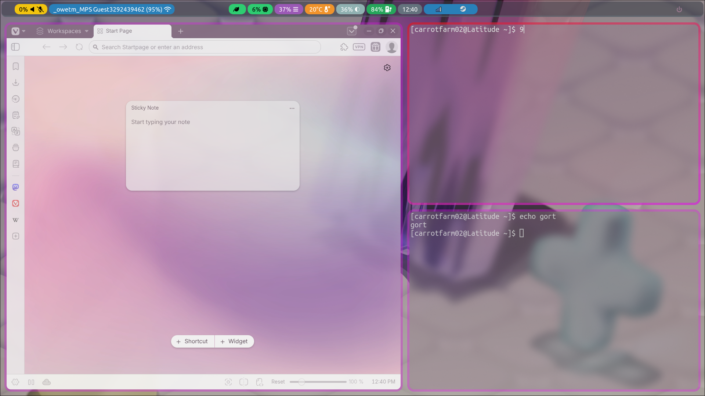
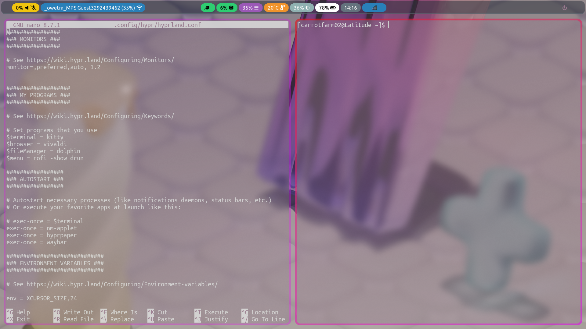
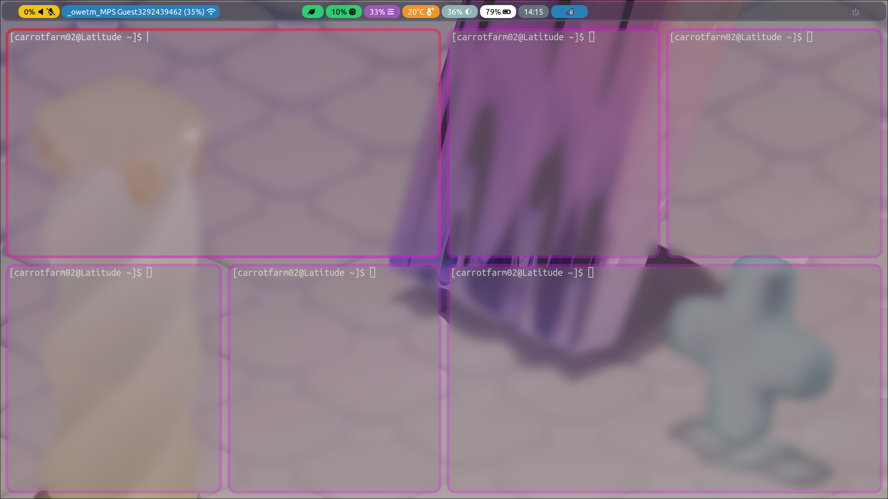

# My-Hypr-Dotfiles
This is mostly for me, but feel free to steal if you want though.

## DEPENDENCIES 
Requires the following packages: 

Hyprland (and all of its dependencies)

Waybar (for the top bar, will cause an error if not installed)

Kitty (main terminal emulator)

Hyprpaper (for the wallpaper)

Dolphin (as the file manager)

Rofi (aplication launcher)

Dunst (notification dispatcher)

Nerd Fonts (the font library that contains the terminal font used for this config)

## INSTALLATION INSTRUCTIONS
step one:

run `git clone https://github.com/carrotfarm02/My-Hypr-Dotfiles` to clone the repository

step two:

make the customizations you want (browser, or whatever)

step three:

move all of the files except for README and dunst inside the  My-Hypr-Dotfiles folder into ~/.config 

step four:

Move the dunst folder into /etc (requires root privlages), which should look like: /etc/dunst/dunstrc

aaaaand you're done! :)
